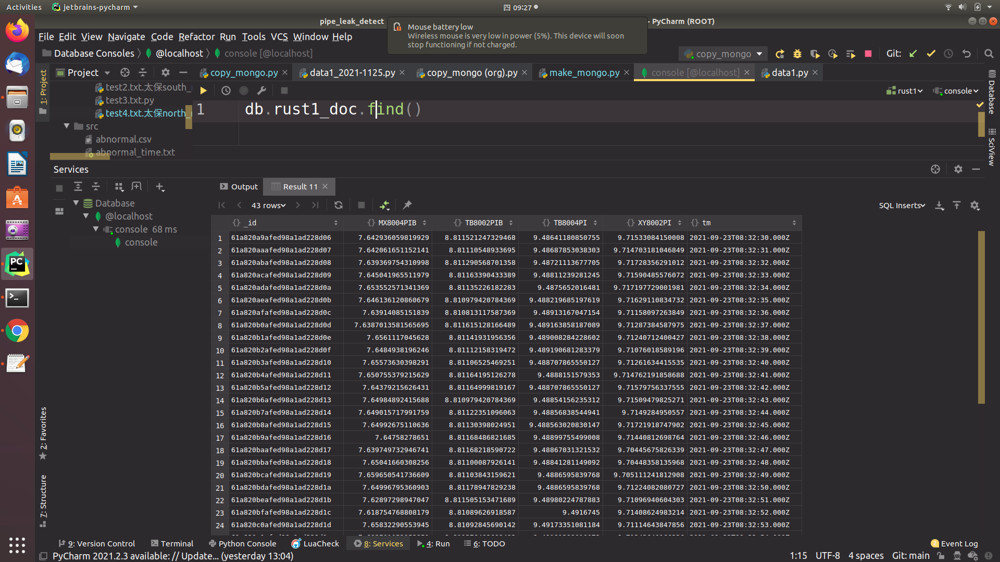
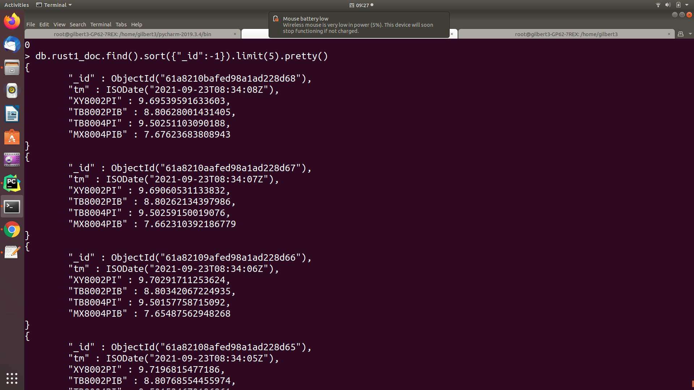

# Pipe Leak Detection 
This is the Pipe Leak Event detection node

## package install
```
pip install scipy
pip install pymongo
pip install pandas
pip install csv
pip install numpy
```

## Environmental requirements
* mongoDB 3.2.x or laster
* https://www.runoob.com/mongodb/mongodb-window-install.html (install mongoDB server on win10)

## Start up reading csv-file to mongoDB
```
1.python3 make_mongo.py
```
## Start up reading data from mongoDB 
```
2.python3 copy_mongo.py
```
## MongoDB Setting & instruction
```
settings = {
    "ip": 'localhost',      # ip:127.0.0.1
    "port": 27017,          # port
    "db_name": "rust1",     # database-name
    "set_name": "rust1_doc" # collection-name
}
```

```
db.rust1_doc.find().sort({"_id":-1}).limit(5).pretty()
```






## Detail
See src/make_mongo.py , src/copy_mongo.py

